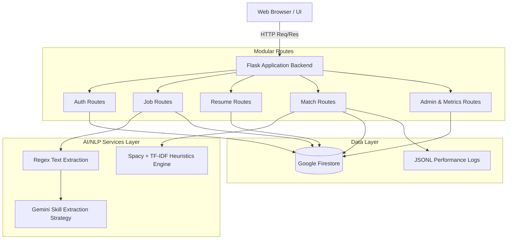
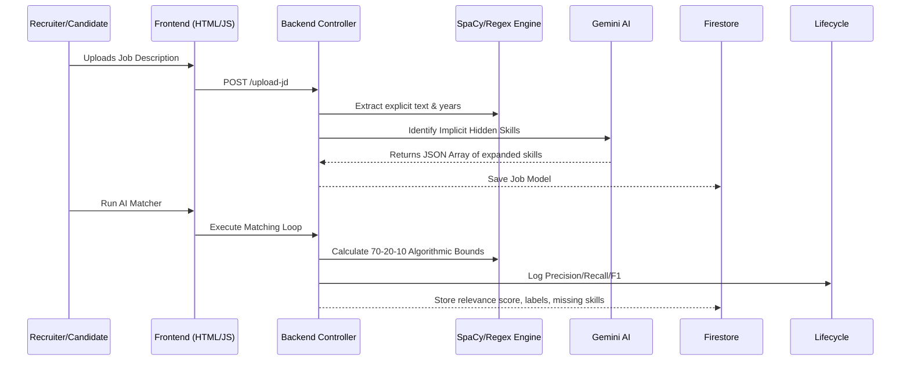

# Project Architecture & Design Documentation

## 1. High-Level System Overview
The **AI-Powered Resume-Job Matching System** operates on a modular, monolithic architecture built upon Flask, utilizing Google Cloud Firestore for NoSQL document storage, and integrates the Gemini-1.5-Flash Large Language Model for deep implicit reasoning and project evaluation.

### Core Architecture Diagram

## 2. The Dual-Engine Matching Algorithm
To achieve production-level strictness and avoid the notorious "hallucination/inflation" issues standard semantic models face, we implemented a highly rigorous **Two-Pass Dual-Engine Pipeline**:

### Pass 1: The 70-20-10 Strict Math Heuristic
Instead of relying solely on SpaCy's Cosine Similarity (which falsely equates different Software domains by yielding generic 0.85+ scores), the AI evaluates resumes mathematically:
*   **70% Weight**: Hard Skill Intersection Ratio. If a candidate lacks core technical backend explicitly requested by the job, their score aggressively plummets.
*   **20% Weight**: SpaCy `en_core_web_md` NLP Document Cosine Similarity. Used only as a semantic smoothing bonus to capture abstract contextual fits.
*   **10% Weight**: Year-over-Year Experience calculation bonus.

### Pass 2: Gemini Job Skill Augmentation
When Jobs are uploaded, the description text passes through the Gemini API (`app/services/ai_service.py`) strictly to extract **implicit requirements**. For example, if a JD requests "scalable orchestration", Gemini mandates "docker" and "kubernetes" as hidden requirements against which the candidate is strictly checked during the mathematical pass.

## 3. Model Lifecycle & Evaluation Framework
To address the "Model Lifecycle Management" requirement, the system implements a persistent logging and evaluation loop:
*   **Metric Extraction:** Every match run calculates `Precision`, `Recall`, and `F1 Score` based on the intersection of extracted vs. required skills.
*   **Lifecycle Logging:** Results are appended to `instance/model_logs/evaluation_metrics.jsonl` with timestamps and model versioning.
*   **Analytics Dashboard:** The Admin Metrics view (`/admin/metrics`) aggregates these logs to show real-time model performance trends.

## 5. Security & Validation
*   **Text Sanitization:** All raw resume text formats (`.pdf`, `.docx`) are passed via custom backend sanitization functions (`sanitize_text()`) to strip potentially malicious payload strings before interacting with memory models.
*   **Authentication Hooks:** Standard protected endpoint routing is enforced across the Blueprint architecture.
